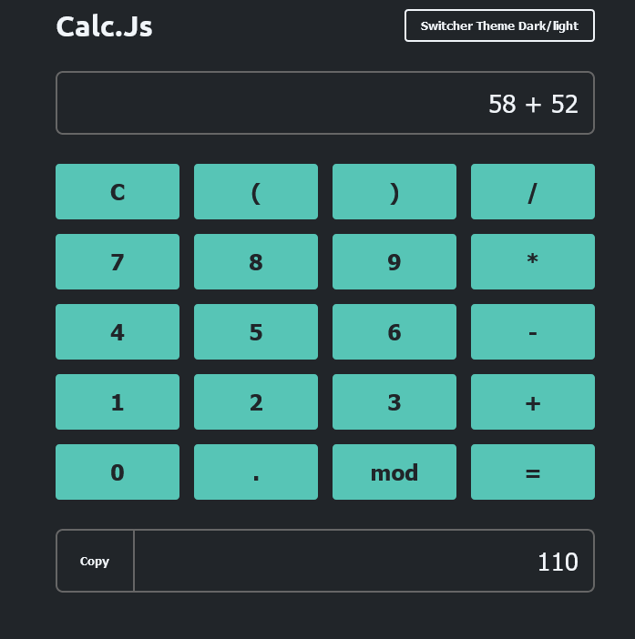

<h1 align="center"> Calculadora</h1>

  

  <a href="#-tecnologias">Tecnologias</a>&nbsp;&nbsp;&nbsp;|&nbsp;&nbsp;&nbsp;
  <a href="#-projeto">Projeto</a>&nbsp;&nbsp;&nbsp;|&nbsp;&nbsp;&nbsp;

 

  

## 💻 Tecnologias

Esse projeto foi desenvolvido com as seguintes tecnologias:

- HTML e CSS - 
- JavaScript -
- Git e Github -

## 📱 Projeto

-  [Visite o projeto online](https://iaguin11.github.io/Calculadora/)
